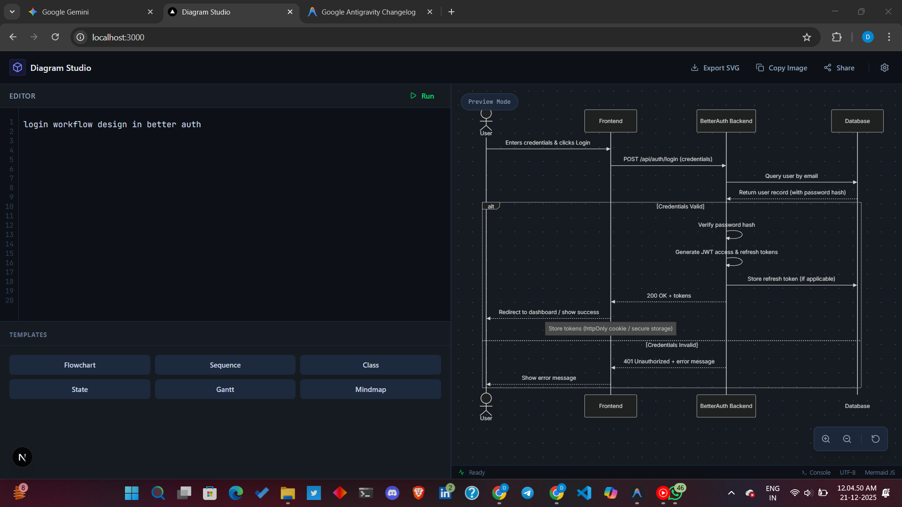

# Archi-Text

**Visualize chaos. Instantly convert natural language, code, and raw data into professional diagrams using local AI.**

Archi-Text is a modern web application that leverages the power of Large Language Models (LLMs) to bridge the gap between text and visualization. Whether you need to visualize a complex algorithm, document a database schema, or map out a system architecture, Archi-Text turns your words into clear, editable Mermaid.js diagrams.



## 🚀 Features

-   **Natural Language to Diagram**: Simply describe your idea ("Product launch timeline") and get a visual representation.
-   **Code Visualization**: Paste functions, classes, or entire files to generate flowcharts, sequence diagrams, or class diagrams.
-   **Infrastructure Mapping**: Visualize Kubernetes YAML, Docker Compose, or Terraform files as system architecture diagrams.
-   **Local AI Privacy**: Built to work seamlessly with **Ollama** running locally. Your code and data never leave your machine unless you configure a remote provider.
-   **Live Preview & Editing**: Real-time rendering of Mermaid diagrams with an integrated editor for manual tweaks.
-   **Exportable**: Export your diagrams for use in documentation, presentations, or wikis.

## 🛠️ Tech Stack

Built with the latest web technologies for speed and performance:

-   **Framework**: [Next.js 16](https://nextjs.org/) (App Router)
-   **Library**: [React 19](https://react.dev/)
-   **Styling**: [Tailwind CSS 4](https://tailwindcss.com/)
-   **Visualization**: [Mermaid.js](https://mermaid.js.org/)
-   **Icons**: [Lucide React](https://lucide.dev/)
-   **AI Integration**: [Ollama](https://ollama.com/)

## 🏁 Getting Started

### Prerequisites

-   [Node.js](https://nodejs.org/) (v18+) or [Bun](https://bun.sh/)
-   [Ollama](https://ollama.com/) installed and running locally

### Installation

1.  **Clone the repository**
    ```bash
    git clone https://github.com/Danish-Devx3/archi-text.git
    cd archi-text
    ```

2.  **Install dependencies**
    ```bash
    bun install
    # or
    npm install
    ```

3.  **Run the development server**
    ```bash
    bun dev
    # or
    npm run dev
    ```

4.  Open [http://localhost:3000](http://localhost:3000) with your browser.

## ⚙️ Configuration

Archi-Text allows you to configure the AI provider directly from the UI. Click the **Settings** icon in the header to configure:

-   **API Key**: Optional for local Ollama. Required if using a cloud provider or a secured proxy.
-   **Base URL**: Defaults to `http://localhost:11434` for local Ollama. Change this if your Ollama instance is hosted elsewhere or if you are using an OpenAI-compatible endpoint.
-   **Model**: Specify the model to use (e.g., `deepseek-coder`, `llama3`, `mistral`).
    *   *Tip: Models with strong coding and logic capabilities like `deepseek-v3` or `llama3.1` tend to produce the best Mermaid syntax.*

## 📸 Usage Examples

### 1. Logic Flowchart
**Input:**
> "Create a flowchart for a user login system. It should handle success, invalid password, and account locked states."

### 2. Code Explanation
**Input:**
> Paste a complex React `useEffect` or a Python data processing function.

### 3. Architecture
**Input:**
> "Show me a sequence diagram for a payment processing system involving a User, API Gateway, Payment Service, and Bank."

---

*Built with ❤️ for developers who prefer reading diagrams over docs.*
